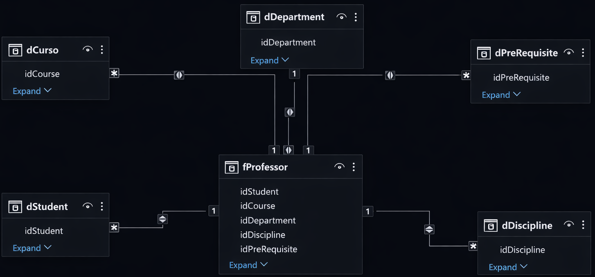
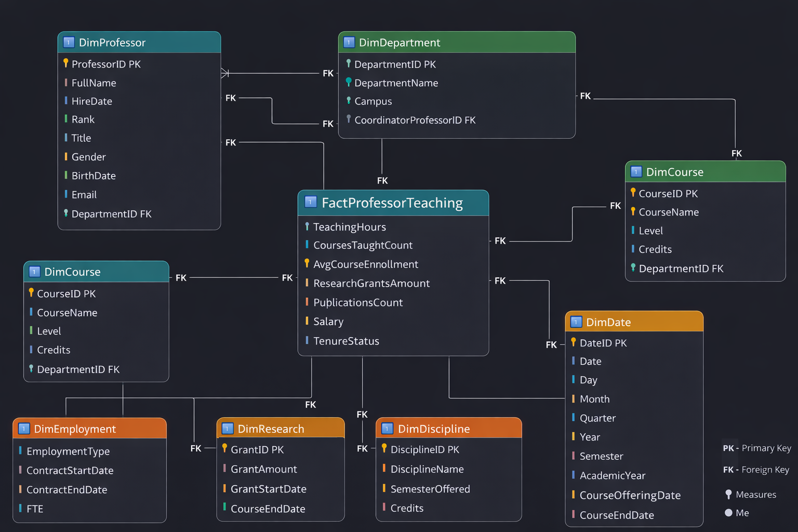

Daily learning

# Sales Dashboard with Power BI using Star Schema

Project developed at the Bootcamp Power BI Analyst Training, under the guidance of specialist [Juliana Zanelatto](https://github.com/julianazanelatto/ "Juliana Zanelatto").

Description of the Dimensional Modeling Challenge

- Objective:
Create the dimensional diagram – star schema – based on the provided relational diagram.

- Focus:
Professor – object of analysis
You will assemble the star schema focusing on the analysis of professor data. Therefore, the fact table should reflect various data about the professor, courses taught, department to which they belong... This gives you an idea of ​​what should compose the fact table of the model in question.

- Note: It is not necessary to reflect data about the students!

- What needs to be done?
The Fact table containing the analyzed context must be created. Similarly, dimension tables containing details related to the context must be created.

- Finally, but no less important, add a date dimension table. To compensate for the lack of date data in the relational model, assume you have access to the data and create the necessary fields for modeling.

- Ex: course offering dates, course offering dates, among others. The format, or rather, the granularity, is not fixed. Different formats can be used that correspond to different levels of granularity.

- Relational Diagram

- Star Schema

[LICENSE](/LICENSE)

See [original repository](https://github.com/julianazanelatto/power_bi_analyst).
